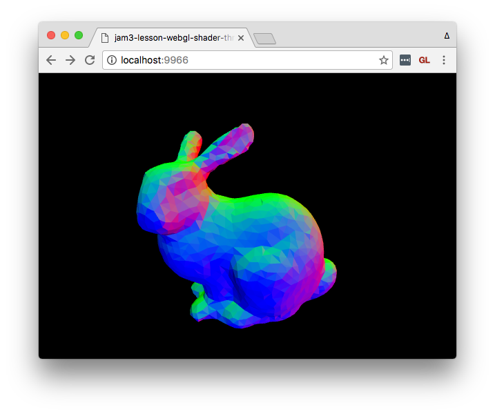

##### [jam3-lesson](https://github.com/Jam3/jam3-lesson) » webgl » shader-threejs

---

# WebGL Lessons — ThreeJS Shaders

In this lesson, we'll learn how to apply Fragment and Vertex shaders to a [ThreeJS](http://threejs.org/) mesh in WebGL. Make sure you read [webgl-shader-intro](https://github.com/Jam3/jam3-lesson-webgl-shader-intro) first to understand the basics of GLSL.

## Contents

- [Why ThreeJS?](#why-threejs)
- [Setup](#setup)
- [Code Overview](#code-overview)
- [Mesh & Shader Materials](#mesh--shader-materials)
- [Step 1: Your First Shader](#step-1-your-first-shader)
  - [Attributes](#attributes)
  - [Uniforms](#uniforms)
  - [Projecting the Vertex](#projecting-the-vertex)
- [Step 2: Distance from Center](#step-2-distance-from-center)
- [Step 3: Visualizing Normals](#step-3-visualizing-normals)
- [Step 4: Exploding Triangles](#step-4-exploding-triangles)
- [Step 5: Animation](#step-5-animation)
- [Appendix: ShaderMaterial vs RawShaderMaterial](#appendix-shadermaterial-vs-rawshadermaterial)

## Why ThreeJS?

Writing raw WebGL involves a lot of boilerplate and adds a great deal of complexity. Instead, we will use ThreeJS to provide a layer of convenience and abstraction, and also to ease ourselves into more advanced ThreeJS lessons.

This lesson will be easier if you already have some basic experience with ThreeJS Scene, Camera, WebGLRenderer etc.

## Setup

You can download [ThreeJS](http://threejs.org/) directly from the site, but for our purposes we will use [npm](https://www.npmjs.com/) and [budo](https://github.com/mattdesl/budo/) for a faster development workflow.

> :bulb: If you haven't used npm or budo, see our lesson [Modules for Frontend JavaScript](https://github.com/Jam3/jam3-lesson-module-basics) for more details.

First, you should clone this repo and install the dependencies:

```sh
git clone https://github.com/Jam3/jam3-lesson-webgl-shader-threejs.git

# move into directory
cd jam3-lesson-webgl-shader-threejs

# install dependencies
npm install

# start dev server
npm run start
```

Now you should be able to open [http://localhost:9966/](http://localhost:9966/) to see a white bunny.


This project uses Babel through [babelify](https://github.com/babel/babelify) (a browserify transform). It also uses [brfs](https://github.com/substack/brfs), which can statically inline files like shaders.

## Code Overview

The code is split into a few different files:

- **[`./lib/index.js`](./lib/index.js)**  
This holds the "guts" of our demo, creating our application, geometry, mesh, and render loop. Since it is the root file, we use this to ensure the `THREE` global can be accessed from other files:  
```js
global.THREE = require('three');
```
- **[`./lib/createApp.js`](./lib/createApp.js)**  
This boilerplate creates a basic ThreeJS application using a helper module, [orbit-controls](https://github.com/Jam3/orbit-controls), for 3D camera movement.

  You can review the code in this file, but it won't be essential to this lesson.

- **[`./lib/createBunnyGeometry.js`](./lib/createBunnyGeometry.js)**  
This helper method creates a ThreeJS geometry from a *mesh primitive*, in this case a 3D bunny.

  For the purpose of this lesson, you can skip over this file.
- **[`./lib/shader.frag`](./lib/shader.frag)**  
This is the fragment shader which you will be editing in this lesson.

- **[`./lib/shader.vert`](./lib/shader.vert)**  
This is the fragment shader which you will be editing in this lesson.

- **[`./lib/reference/`](./lib/reference/)**  
Here you can find some shader references for each step in this lesson.

## Mesh & Shader Materials

In ThreeJS, a `Mesh` is the basic building block for rendering 3D shapes. It is made up of a `Geometry` (often re-used for memory) and a `Material`. For example, this code adds a red cube to the scene:

```js
const geometry = new THREE.BoxGeometry(1, 1, 1);
const material = new THREE.MeshBasicMaterial({ color: 'red' });
const mesh = new THREE.Mesh(geometry, material);
scene.add(mesh);
```

In our [./lib/index.js](./lib/index.js), we have some similar code that sets up a 3D bunny geometry:

```js
// Get a nicely prepared geometry
const geometry = createBunnyGeometry({ flat: true });
```

Next, we create a material for the bunny.

We use a `RawShaderMaterial`, which is a special type of material that accepts `vertexShader` and `fragmentShader` strings. We are using [brfs](https://github.com/substack/brfs), a source transform, so that we can keep our shaders as separate files and inline them at bundle-time.

```js
const path = require('path');
const fs = require('fs');

// Create our vertex/fragment shaders
const material = new THREE.RawShaderMaterial({
  vertexShader: fs.readFileSync(path.join(__dirname, 'shader.vert'), 'utf8'),
  fragmentShader: fs.readFileSync(path.join(__dirname, 'shader.frag'), 'utf8')
});
```

> :bulb: Later, you may wish to explore [glslify](https://github.com/stackgl/glslify) instead of `brfs`.

Our bunny mesh is then created the same was as our box:

```js
// Setup our mesh
const mesh = new THREE.Mesh(geometry, material);
scene.add(mesh);
```

### Step 1: Your First Shader

<sup>Reference: [shader.vert](./lib/shader.vert), [shader.frag](./lib/shader.frag)</sup>


The initial shader provided with this repo just renders the 3D mesh with a flat white material. It's a good idea to always start with a basic shader before you dive into other effects.

#### Vertex Shader

The vertex shader at [`./lib/shader.vert`](./lib/shader.vert) looks like this:

```glsl
attribute vec3 position;

uniform mat4 projectionMatrix;
uniform mat4 modelViewMatrix;

void main () {
  gl_Position = projectionMatrix * modelViewMatrix * vec4(position, 1.0);
}
```

Fragment and vertex shaders require a `main()` function — it gets called by WebGL for each vertex (or fragment) in our mesh.

This vertex shader introduces two new concepts: **attributes** and **uniforms**.

##### Attributes

A vertex shader runs on each *vertex* in a geometry. A vertex can contain various *attributes*, such as Position (XYZ), UV coordinates (XY), Normal (XYZ), etc. The attributes are set up in JavaScript, and end up as read-only inputs to our vertex shader.

For example, the triangle below has 3 *vertices*, each vertex has one *attribute* that holds the XYZ position. For this triangle, the vertex shader would be executed 3 times by the GPU.


Our bunny vertex shader only has one attribute for the vertex position.

```glsl
attribute vec3 position;
```

##### Uniforms

Vertex and fragment shaders can also have *uniforms*, which is a constant value across all triangles (or fragments) in a render call. This value, set from JavaScript, is read-only in the vertex and fragment shaders.

For example, we could use a `uniform` to define a constant RGB color for our mesh.

ThreeJS provides a few built-in uniforms for shaders, such as the following 4x4 matrices, as `mat4` data types:

- `projectionMatrix` — used to convert 3D world units into 2D screen-space.
- `viewMatrix` — an inverse of our `PerspectiveCamera`'s world matrix
- `modelMatrix` — the model-space matrix of our `Mesh`
- `modelViewMatrix` — a combination of the view and model matrix

> :bulb: If you aren't familiar with matrices, don't fret! We plan to cover the basics of vector math in a later lesson.

If you use one of these, you will need to define it like so:

```glsl
uniform mat4 projectionMatrix;
uniform mat4 modelViewMatrix;
```

#### Projecting The Vertex

The role of the vertex shader is to turn our 3D data (e.g. position) into features that WebGL's rasterizer can use to fill our shapes on a 2D screen. This is known as "projecting" 3D world coordinates into 2D screen-space coordinates.

To do this, we use the following pattern:

```glsl
gl_Position = projectionMatrix * modelViewMatrix * vec4(position, 1.0);
```

> :bulb: It's not yet necessary to understand why `1.0` is used as the `w` component in position. If you are curious, you can read more [here](http://www.tomdalling.com/blog/modern-opengl/explaining-homogenous-coordinates-and-projective-geometry/).

The above could also be written a little differently, by specifying `vec4` for the attribute (WebGL will expand vectors with `w=1.0` by default) and multiplying each matrix independently.

```glsl
attribute vec4 position;

uniform mat4 projectionMatrix;
uniform mat4 modelMatrix;
uniform mat4 viewMatrix;

void main () {
  gl_Position = projectionMatrix * viewMatrix * modelMatrix * position;
}
```

#### Fragment Shader

If you open up [`./lib/shader.frag`](./lib/shader.frag), you'll see the fragment shader:

```glsl
precision highp float;

void main () {
  gl_FragColor = vec4(1.0);
}
```

The first line, with `precision`, defines the floating point precision the GPU should use by default for all floats. When using `RawShaderMaterial`, you will need to specify this at the top of your fragment shaders. You can use `lowp`, `mediump`, or `highp`, but typically `highp` is recommended.

> :bulb: The default precision for vertex shaders is `highp`, so we didn't need to define it earlier.

Then, we have `gl_FragColor`, which is a builtin write-only `vec4` for the output color. You should always write all 4 channels to this in your fragment shader. In our case, we are using pure white: `(1.0, 1.0, 1.0, 1.0)`. This is similar to [ShaderToy's](http://shadertoy.com/) `fragColor` variable.

## Step 2: Distance from Center

<sup>Reference: [shader2.vert](./lib/reference/shader2.vert), [shader2.frag](./lib/reference/shader2.frag)</sup>


Next, we'll apply a radial gradient to our mesh by coloring each pixel based on its XYZ distance from world center, `(0, 0, 0)`.

You can edit your `shader.vert` and `shader.frag` to see the new changes locally.

### Vertex Shader

In this step, our vertex shader looks like this:

```glsl
attribute vec4 position;

uniform mat4 projectionMatrix;
uniform mat4 modelViewMatrix;

varying float distFromCenter;

void main () {
  distFromCenter = length(position.xyz);
  gl_Position = projectionMatrix * modelViewMatrix * position;
}
```

This shader introduces a new concept: **varyings**. This is a write-only value that will get passed down the pipeline to the fragment shader. Here, we take the magnitude of the `position` vector, i.e. compute its distance from origin `vec3(0.0)`.

> :bulb: You can also use the `distance` built-in, like so:
```glsl
distFromCenter = distance(position.xyz, vec3(0.0));
```

### Fragment Shader

```glsl
precision highp float;

varying float distFromCenter;
void main () {
  gl_FragColor = vec4(vec3(distFromCenter), 1.0);
}
```

In a fragment shader, varyings are read-only. They are inputs from the vertex shader. Their values are interpolated between vertices, so if you have a `0.0` float coming from one vertex, and `1.0` coming from another, each fragment will end up with some values in-between.

In our case, the fragment RGB color is set to the `distFromCenter`, which gives us values that are black near the world origin, and more white as the vertices move away from this point.


## Step 3: Visualizing Normals

<sup>Reference: [shader3.vert](./lib/reference/shader3.vert), [shader3.frag](./lib/reference/shader3.frag)</sup>



In this step, we visualize the *normals* of the mesh. This is a new attribute, already specified in `createBunnyGeometry.js`, that defines the way each triangle points away from the center. Normals are often used in surface lighting and other effects.

A normal is a unit vector, which means its components are normalized to the range -1.0 to 1.0.

### Vertex Shader

```glsl
attribute vec4 position;
attribute vec3 normal;

uniform mat4 projectionMatrix;
uniform mat4 modelViewMatrix;

varying vec3 vNormal;

void main () {
  vNormal = normal;
  gl_Position = projectionMatrix * modelViewMatrix * position;
}
```

In this shader, we include a new attribute, `normal`, and pass it along to the fragment shader with the `vNormal` varying.

### Fragment Shader

```glsl
precision highp float;

varying vec3 vNormal;

void main () {
  gl_FragColor = vec4(vNormal, 1.0);
}
```

Here, we simply render the passed `vNormal` for each fragment. It ends up looking nice, even though some values will be clamped because they are less than 0.0.

> :bulb: The geometry in `index.js` is created with `{ flat: true }`, which means the normals should be separated. You can try toggling that to see how it looks with combined (smooth) normals.

## Step 4: Exploding Triangles

<sup>Reference: [shader4.vert](./lib/reference/shader4.vert), [shader4.frag](./lib/reference/shader4.frag)</sup>


Now, let's push each triangle along its face normal to create an explosion effect! :fire:

### Vertex Shader

```glsl
attribute vec4 position;
attribute vec3 normal;

uniform mat4 projectionMatrix;
uniform mat4 modelViewMatrix;

varying vec3 vNormal;

void main () {
  vNormal = normal;

  vec4 offset = position;
  float dist = 0.25;
  offset.xyz += normal * dist;
  gl_Position = projectionMatrix * modelViewMatrix * offset;
}
```

In this shader, we offset each vertex position by a vector. In this case, we use the `normal` to know which direction the position should be offset, and a `dist` scalar to determine how far away the triangles should be pushed.

We can leave the fragment shader unchanged.

## Step 5: Animation

<sup>Reference: [shader5.vert](./lib/reference/shader5.vert), [shader5.frag](./lib/reference/shader5.frag)</sup>


Lastly, we'll animate the explosion by adding a uniform to the shader material.

This needs to be set up from JavaScript, so make sure our `index.js` defines a `uniforms` option in the material:

```js
// Create our vertex/fragment shaders
const material = new THREE.RawShaderMaterial({
  vertexShader: fs.readFileSync(path.join(__dirname, 'shader.vert'), 'utf8'),
  fragmentShader: fs.readFileSync(path.join(__dirname, 'shader.frag'), 'utf8'),
  uniforms: {
    time: { type: 'f', value: 0 }
  }
});
```

Above, we define a `time` uniform (which will be accessed by that name in the shader), give it a float type (ThreeJS uses `'f'` — see [here](https://github.com/mrdoob/three.js/wiki/Uniforms-types) for others), and provide a default value.

Then, our render loop increments the value every frame, and changes the `value` field of our `time` uniform.

```js
// Time since beginning
let time = 0;

// Start our render loop
createLoop((dt) => {
  // update time
  time += dt / 1000;

  // set value
  material.uniforms.time.value = time;

  // render
  ...
}).start();
```

### Vertex Shader

```glsl
attribute vec4 position;
attribute vec3 normal;

uniform mat4 projectionMatrix;
uniform mat4 modelViewMatrix;

uniform float time;

varying vec3 vNormal;

void main () {
  vNormal = normal;

  vec4 offset = position;

  // Animate between 0 and 1
  // sin(x) returns a value in [-1...1] range
  float dist = sin(time) * 0.5 + 0.5;

  offset.xyz += normal * dist;
  gl_Position = projectionMatrix * modelViewMatrix * offset;
}
```

In this shader, we first define our uniform before our main function. Since it's a uniform, it will be the same value for all vertices in that render call.

```glsl
uniform float time;
```

We can use the built-in `sin()` function (equivalent to `Math.sin` in JavaScript), which gives us back a value from -1.0 to 1.0. Then we normalize it into 0 to 1 range, so that our mesh is always exploding outward:

```glsl
float dist = sin(time) * 0.5 + 0.5;
```

Voilà! We have an exploding bunny! :rabbit:

## Appendix: ShaderMaterial vs RawShaderMaterial

At some point you may wonder why ThreeJS has both `ShaderMaterial` and `RawShaderMaterial`. Typically I suggest using `RawShaderMaterial` since it is less error-prone, but it means you have to be a bit more verbose and manually specify precision, extensions, etc.

Instead, you can use `ShaderMaterial` and skip some definitions, such as ThreeJS's built-in attributes, uniforms and fragment shader precision:

```glsl
void main () {
  gl_Position = projectionMatrix * modelViewMatrix * vec4(position.xyz, 1.0);
}
```

## Next Steps

Stay tuned for future lessons on ThreeJS shaders, BufferGeometry, custom attributes, and more!